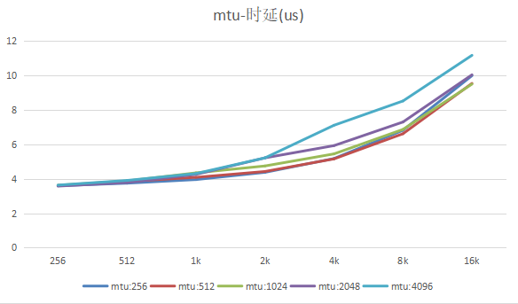

# 性能测试

- [1. 设备端口号](#1-设备端口号)
- [2. mtu](#2-mtu)
- [3. rx_depth 每次 post RR 的个数](#3-rx_depth-每次-post-rr-的个数)
- [4. 是否使用 event](#4-是否使用-event)
- [5. odp & dm](#5-odp--dm)
- [6. ts](#6-ts)
- [其他](#其他)

使用 ibv_rc_pingpong 可运行程序

## 1. 设备端口号

同一个设备（同一台机器），不同 port：

```shell
ibv_rc_pingpong --ib-port=1 --size=64 --iters=1000000
ibv_rc_pingpong --ib-port=2 --size=64 --iters=1000000 localhost
```

```txt
128000000 bytes in 3.29 seconds = 311.36 Mbit/sec
1000000 iters in 3.29 seconds = 3.29 usec/iter
```

同一个设备（同一台机器），相同 port：

```shell
ibv_rc_pingpong --ib-port=1 --size=64 --iters=1000000
ibv_rc_pingpong --ib-port=1 --size=64 --iters=1000000 localhost
```

```txt
128000000 bytes in 2.63 seconds = 389.83 Mbit/sec
1000000 iters in 2.63 seconds = 2.63 usec/iter
```

| size | 不同端口 | 相同端口 |
| ---- | -------- | -------- |
| 64   | 3.29     | 2.63     |
| 1024 | 4.29     | 3.97     |
| 16k  | 9.53     | 9.99     |

**结论**：**不同的端口号延迟会高一些，吞吐量有待测试**。

> 不过这个测试没啥用，分布式环境下，端口号肯定都不同。

## 2. mtu

```shell
ibv_rc_pingpong --ib-port=1 --size=4096 --iters=1000000 -m 1024
ibv_rc_pingpong --ib-port=2 --size=4096 --iters=1000000 -m 1024 localhost
```

| size | mtu:256 | mtu:512 | mtu:1024 | mtu:2048 | mtu:4096 |
| ---- | ------- | ------- | -------- | -------- | -------- |
| 256  | 3.59    | 3.60    | 3.62     | 3.57     | 3.63     |
| 512  | 3.74    | 3.84    | 3.87     | 3.78     | 3.90     |
| 1k   | 3.95    | 4.08    | 4.34     | 4.25     | 4.30     |
| 2k   | 4.37    | 4.42    | 4.74     | 5.21     | 5.21     |
| 4k   | 5.17    | 5.15    | 5.44     | 5.92     | 7.10     |
| 8k   | 6.81    | 6.61    | 6.86     | 7.29     | 8.51     |
| 16k  | 9.98    | 9.53    | 9.49     | 10.03    | 11.16    |



**结论**：**对于双边原语，发送小数据时（如小16k），mtu选择1024或者512时，性能是比较好的。但对于小于1k的数据，mtu的选取没有太大关系**。

ibv_rc_pingpong 默认使用的mtu是 path MTU (default 1024)

对于基于send的rpc，或许可以适当设置小一点的mtu。不过如果是单双边结合的，这个优化就无所谓了。

## 3. rx_depth 每次 post RR 的个数

size: 1024

| rx_depth | 时延(us) |
| -- | -- |
| 1 | 16.12 |
| 10 | 5.35 |
| 100 | 4.33 |
| 200 | 4.29 |
| 400 | 4.28 |
| 800 | 4.28 |

结论: **rx_depth 取 >200，时延保持较低**。

## 4. 是否使用 event

| 使用事件 | 不使用事件 |
| -- | -- |
| 10.05 | 4.31 |

结论: 对于大型系统来说，**如果网络不是瓶颈，建议使用事件，减少对cpu的消耗**。否则使用轮询，减少网络延迟。

## 5. odp & dm

实验室设备不支持，不测试

## 6. ts

没差别，只是多一些统计信息而已

```shell
--no ts, size: 1024
  local address:  LID 0x0004, QPN 0x000487, PSN 0xad861a, GID ::
  local address:  LID 0x0008, QPN 0x000488, PSN 0x1859c8, GID ::
  remote address: LID 0x0008, QPN 0x000488, PSN 0x1859c8, GID ::
  remote address: LID 0x0004, QPN 0x000487, PSN 0xad861a, GID ::
2048000000 bytes in 4.28 seconds = 3828.29 Mbit/sec
2048000000 bytes in 4.28 seconds = 3828.43 Mbit/sec
1000000 iters in 4.28 seconds = 4.28 usec/iter
1000000 iters in 4.28 seconds = 4.28 usec/iter
--ts, size: 1024
  local address:  LID 0x0004, QPN 0x000489, PSN 0x7097fe, GID ::
  local address:  LID 0x0008, QPN 0x00048a, PSN 0xb53886, GID ::
  remote address: LID 0x0008, QPN 0x00048a, PSN 0xb53886, GID ::
  remote address: LID 0x0004, QPN 0x000489, PSN 0x7097fe, GID ::
2048000000 bytes in 4.27 seconds = 3841.27 Mbit/sec
2048000000 bytes in 4.27 seconds = 3841.42 Mbit/sec
1000000 iters in 4.27 seconds = 4.27 usec/iter
1000000 iters in 4.27 seconds = 4.27 usec/iter
Max receive completion clock cycles = 281474976646913
Max receive completion clock cycles = 281474976646935
Min receive completion clock cycles = 1684
Min receive completion clock cycles = 1708
Average receive completion clock cycles = 3659180177.943563
Average receive completion clock cycles = 4222130694.312377
```

## 其他

对于send/recv, 这个设置越小，延迟就越小。
单边原语还没测试过

uint32_t cfg_max_send_sge = 1;  // 32, 
uint32_t cfg_max_recv_sge = 1;  // 32

